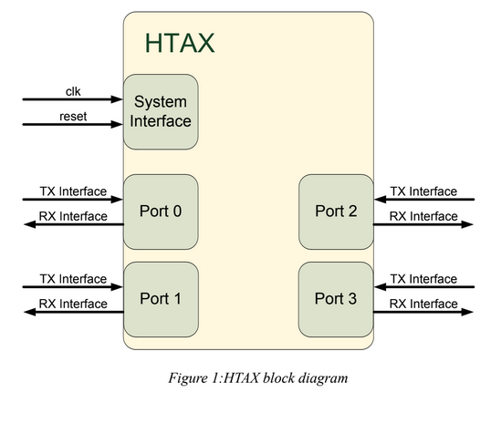

# HTAX Protocol Verification Project



This repository contains the verification environment for the **HTAX Protocol** using **SystemVerilog** and **UVM** (Universal Verification Methodology). The verification plan was designed to ensure the functional correctness of the DUT by thoroughly validating the RX/TX interfaces and achieving high coverage metrics through systematic testing and regression analysis.

---

## 🚀 **Project Overview**

In this project, a robust verification environment was built for the HTAX Protocol, leveraging **Cadence vManager** for verification planning and **Cadence IMC** for coverage analysis. The key components of the environment include UVM sequences, assertions, and monitors for the RX/TX interfaces, along with a scoreboard to validate DUT functionality.

---

## 🛠️ **Project Highlights**

- **Verification Plan**: Created a comprehensive verification plan for the HTAX Protocol using **Cadence vManager** to outline verification strategies and goals.
- **UVM Sequences**: Developed reusable and configurable UVM sequences to stimulate various scenarios for the RX/TX interfaces.
- **Assertions**: Implemented SystemVerilog assertions to validate the correctness of key protocol behaviors.
- **Monitors**: Designed monitors to observe transactions and collect data for functional and protocol checks.
- **Scoreboard**: Built a scoreboard to compare expected and actual results, ensuring accuracy in validation.
- **Automated Regressions**: Ran multiple regressions using **Cadence IMC** to generate and analyze detailed coverage reports.
- **Coverage Achievements**:
  - **Functional Coverage**: Over 90% functional coverage achieved.
  - **Code Coverage**: Over 90% code coverage achieved.

---

## 📂 **Directory Structure**

```plaintext
work/
├── design/           # Design-related files and DUT
├── sim/              # Simulation scripts and configuration files
├── tb/               # Testbench components (monitors, drivers, sequences)
├── test/             # Test files and test scenarios
├── README.md         # Project documentation
├── setupX.bash       # Bash setup script for environment configuration
└── setupX.csh        # C shell setup script for environment configuration
```

---

## ⚙️ **Setup Instructions**

1. **Clone the Repository**:
   ```bash
   git clone https://github.com/yourusername/htax-verification.git
   cd htax-verification
   ```

2. **Set Up Your Simulation Environment**:
   Run the appropriate setup script based on your shell:
   - **For Bash**:
     ```bash
     source setupX.bash
     ```
   - **For C Shell**:
     ```csh
     source setupX.csh
     ```

3. **Run Simulation and Regression**:
   Open sim/run_vm.vsif. Include the tests under the “Add Tests Here” marker. Use the template provided in the file. Change count to run a test multiple number of times.
   <!-- ```bash
   make compile   # Compiles the design and testbench files.
   make simulate  # Runs the simulation with the required testbench and DUT.
   make regress   # Runs the regression to check multiple test cases.
   make coverage  # Analyzes the functional and code coverage.
   ``` -->

---

## 📊 **Results and Achievements**

- **Functional Coverage**: 100% achieved.
- **Block Coverage**: 95% achieved.
- **Expression Coverage**: 95% achieved.
- **Toggle Coverage**: 90% achieved.

---

## 🤝 **Contributions**

Feel free to raise issues or submit pull requests for enhancements. Contributions are welcome!

---

## 📝 **Future Improvements**

- Add corner-case scenarios to further increase protocol robustness.
- Enhance the testbench with additional randomized scenarios for stress testing.
- Optimize regression run time by parallelizing test cases.

---

## 📧 **Contact**

For any questions or feedback, please reach out at **[eshaanmandal@tamu.edu](mailto:eshaanmandal@tamu.edu)**.

---
